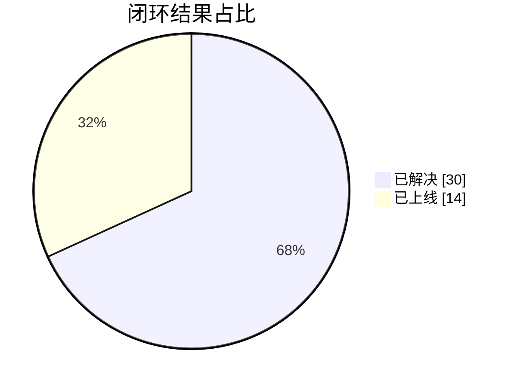
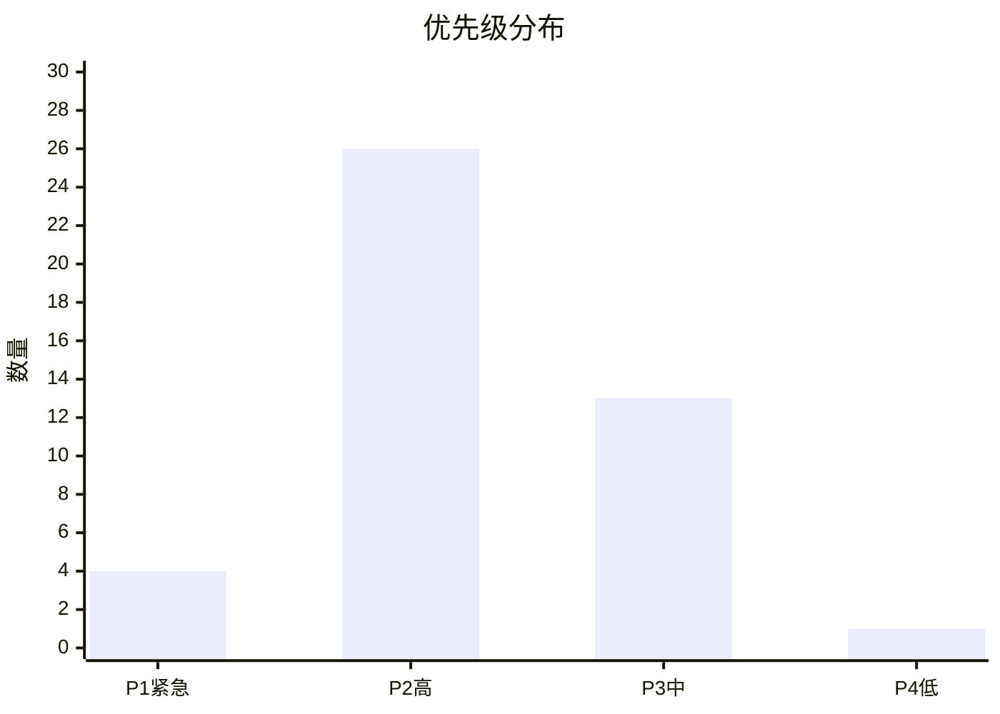
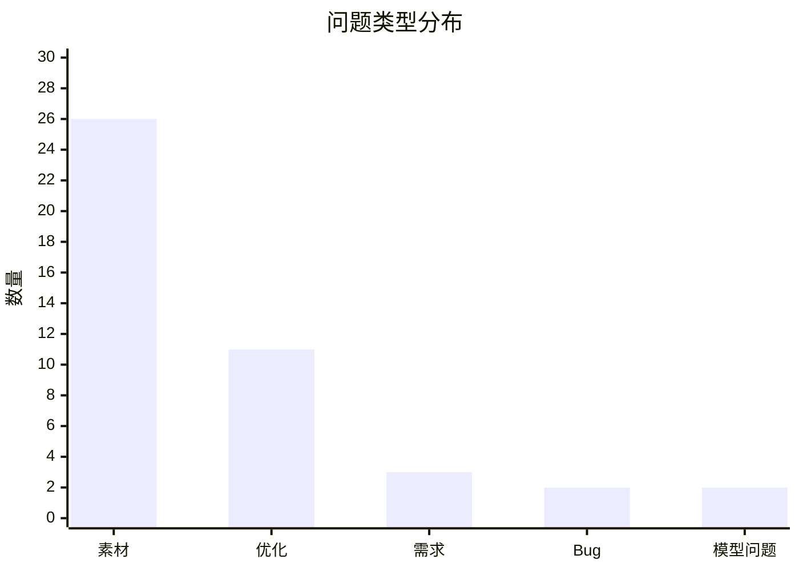
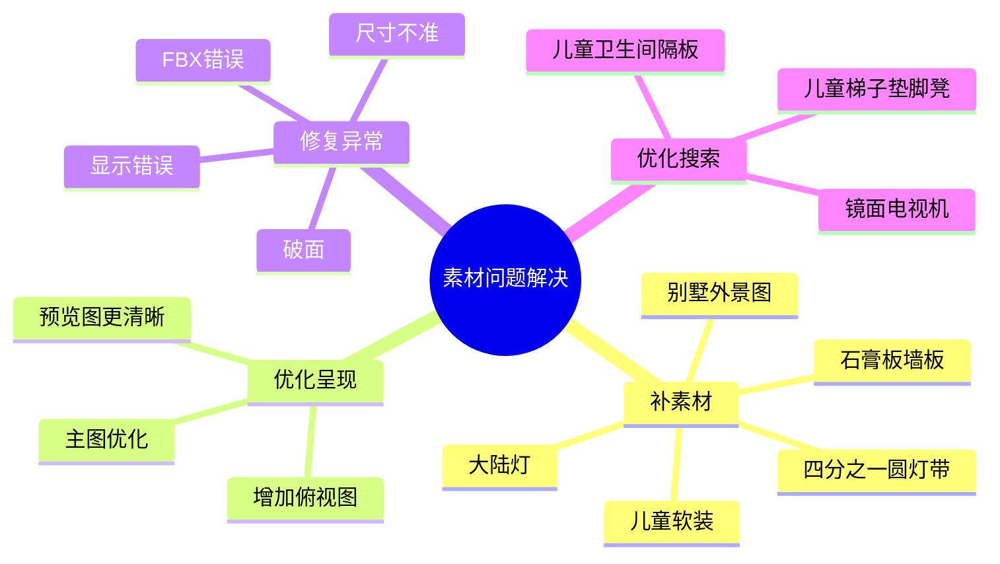
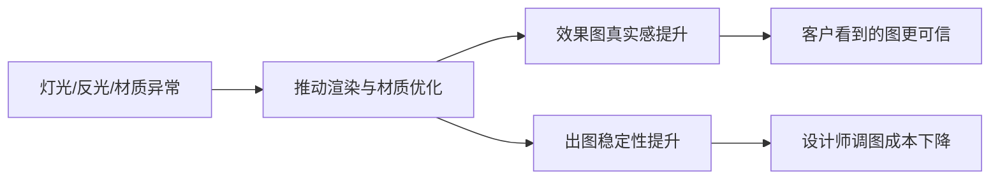
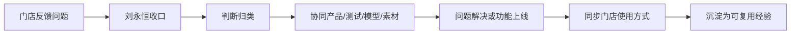
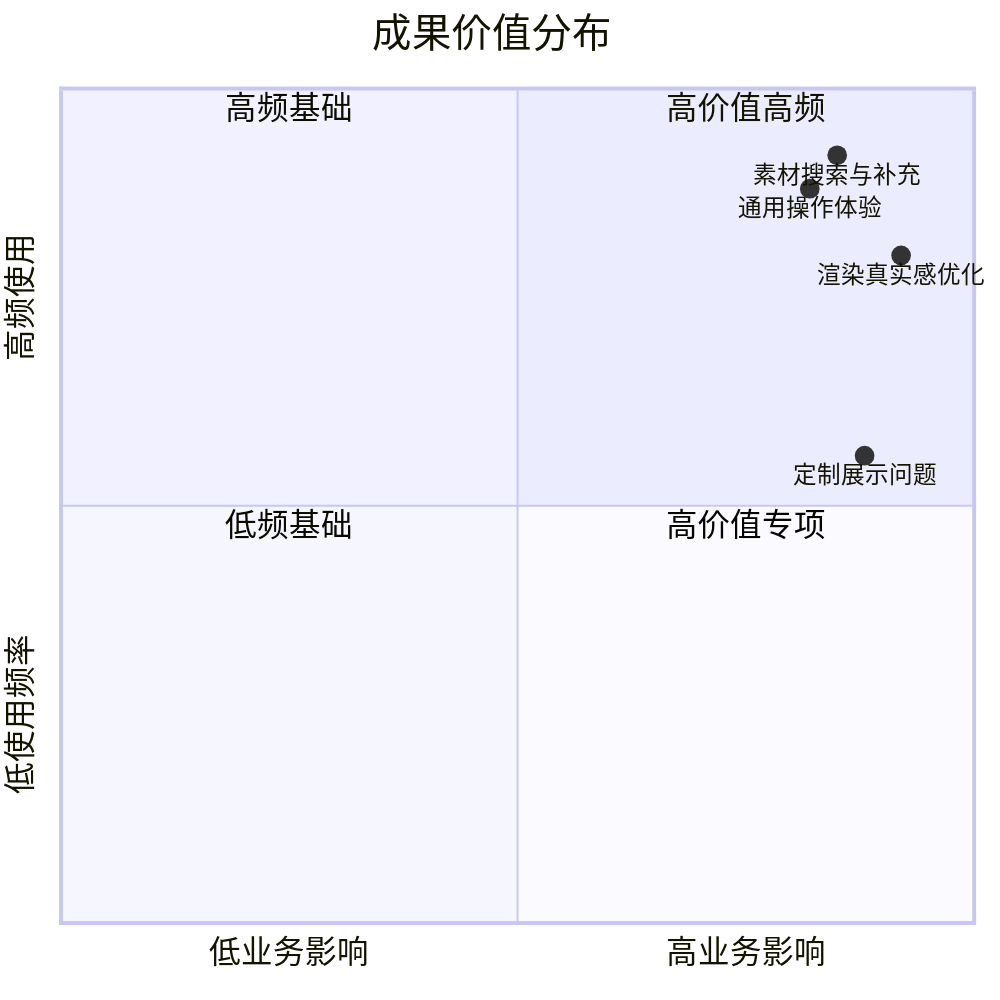

## 一、成绩总览

在本周期内，我围绕门店设计师使用七筑过程中遇到的需求、问题和优化事项，持续承担了需求收口、问题判断、跨部门推进和结果闭环的工作。

从结果看，这不是简单地“登记问题”，而是实实在在推动了一批影响门店出图效率、客户沟通效果和软件使用体验的问题落地解决。

### 核心结果

| 指标 | 结果 |
| --- | ---: |
| 累计闭环问题/需求 | 44 |
| 已解决 | 30 |
| 已上线 | 14 |
| 完成闭环率 | 100% |

### 问题等级分布

| 优先级   |  数量 |  占比 |
| ----- | --: | --: |
| P1 紧急 |   4 |  9% |
| P2 高  |  26 | 59% |
| P3 中  |  13 | 30% |
| P4 低  |   1 |  2% |

结论：我处理的问题中，`P2 高优先级` 占比最高，说明我解决的多数事项都属于一线使用中高频、直接影响设计效率和客户展示效果的问题。

### 类型分布图

结论：我处理的事项中，`素材类问题` 占比最高，说明我解决的重点集中在门店最常用、最容易影响方案效率和效果表现的核心环节。

## 二、我重点解决了什么问题

从整体看，我解决的问题主要集中在四个方向，这四类事项基本覆盖了门店使用七筑时最核心的痛点。

### 1. 解决了大量素材相关问题，提升设计师找素材、用素材、出效果图的效率

素材类问题占全部事项的 `59%`，是最主要的一类工作内容。围绕这一块，我推动解决的不是单一模型补充，而是一整套素材使用体验问题。

我重点推进解决了以下几类问题：

| 解决方向 | 具体成果 |
| --- | --- |
| 补素材 | 补充别墅外景图、四分之一圆灯带、儿童类软装、石膏板墙板、大陆灯等门店高频所需素材 |
| 优化素材呈现 | 解决预览图看不清、增加俯视图、优化素材主图，降低设计师识别成本 |
| 修复素材异常 | 处理模型破面、尺寸不准、显示错误、错误 FBX 替换等问题 |
| 优化素材搜索与分类 | 推动素材分类细化、增加关键词搜索路径，如镜面电视机、儿童卫生间隔板、儿童梯子垫脚凳等 |
| 提升素材真实感 | 优化电视模型、玻璃材质、木地板法线、门板材质等影响效果图质量的问题 |

带来的直接结果是：

1. 门店设计师在素材获取上的阻力明显降低。
2. 素材从“有没有”进一步改善到“好不好找、好不好用、像不像实物”。
3. 素材问题不再只靠临时沟通解决，而是逐步形成可复用的搜索和使用路径。

### 2. 解决了渲染表现问题，提升了效果图真实度和稳定性

渲染类问题虽然数量不是最多，但对门店成交表达影响最大，因为客户最终看到的是图。

这部分我重点推动解决了：

| 解决方向 | 具体成果 |
| --- | --- |
| 灯光表现优化 | 处理灯带发光方向识别、灯光不亮、暖光难调、上下发光灯条需求等问题 |
| 渲染稳定性优化 | 处理默认模板偏黑、场景异常反光、莫名光源等影响出图稳定性的问题 |
| 材质效果优化 | 推动门板起泡、水漆极致黑无质感、玻璃失真、地板法线弱等问题的修正 |
| 特殊场景适配 | 针对深色柜体、深色地面、特殊户型等情况推动给出更合适的解决路径 |

这部分工作的价值是：

1. 提升了效果图的真实感，减少“图不高级、图不真实”的反馈。
2. 降低了设计师因为默认参数不稳定而反复调图的成本。
3. 让门店在面对客户时，展示结果更稳定、更有说服力。

### 3. 解决了通用操作与使用体验问题，提升了一线设计效率

除了素材和渲染，我还推动处理了一批设计师在日常使用中“最容易卡住”的通用问题。

重点包括：

| 解决方向 | 具体成果 |
| --- | --- |
| 设计能力补充 | 推动斜角柜、壁龛构件、双拉手效果表达等需求落地 |
| 上传与制作规范 | 对接 3D 模型上传规范，帮助设计师明确上传条件和注意事项 |
| 贴图与显示一致性 | 解决贴图比例异常、模型显示和渲染不一致等问题 |
| 使用认知优化 | 对门店解释分类、搜索、功能边界和替代方案，减少无效尝试 |

这类工作看似不如 bug 明显，但对一线效率影响非常直接。它解决的是设计师“能不能顺畅把方案做出来”的问题。

### 4. 解决了容易引发客户误解的定制展示问题，降低前端沟通风险

定制类问题虽然数量不算最多，但风险最高，因为一旦展示错误，客户会直接怀疑方案质量和专业度。

我重点推进解决了：

| 解决方向 | 具体成果 |
| --- | --- |
| 玻璃材质表现 | 推动灰玻、白玻、玉沙、油砂、长虹、香梨等玻璃相关问题的澄清和优化 |
| 门窗构件适配 | 处理定制窗高度不跟随、落地窗深度适配、圆弧窗/转角窗使用边界等问题 |
| 定制模型异常 | 解决集成炉灶白边、抽屉双拉手表现、大陆灯模型补充等问题 |

这部分结果的意义在于：

1. 降低了因展示失真带来的客户误解。
2. 提升了门店对特殊材质、特殊构件的表达能力。
3. 让前端销售和设计在讲解方案时更有底气。

## 三、我做成的，不只是“处理问题”，而是推动闭环

如果只看表面，这份表是一批需求和问题；但从工作结果看，我完成的是一套完整的闭环动作：

| 工作环节 | 我的作用 |
| --- | --- |
| 收集问题 | 接住门店一线真实反馈，识别高频痛点 |
| 判断问题 | 区分 bug、需求、优化项和能力边界 |
| 推动处理 | 协同产品、测试、模型、素材等角色推进解决 |
| 解释结果 | 向门店同步解决方案、使用规范、搜索路径和替代方式 |
| 形成沉淀 | 把一次性问题转成可复用经验，减少重复沟通 |

换句话说，我承担的不是简单记录员角色，而是门店问题的 `收口人、推动人、解释人、闭环人`。

## 四、这份成绩单体现出的个人价值

通过这批事项，可以明确体现出我在门店需求工作中的几个核心价值：

### 1. 我能解决高频业务问题

我处理的大多数事项都不是边角问题，而是直接影响门店设计师高频使用的软件、素材、渲染和展示问题。

### 2. 我能把一线问题推进到落地

很多问题并不是我个人直接修改系统，但我可以把门店的模糊反馈转成可执行事项，并推动相关团队给出结果。

### 3. 我能兼顾问题解决和业务解释

对于能解决的问题，我推进上线；对于暂时不能解决的问题，我也能给出清晰解释、使用边界和替代方案，避免门店长期卡在同一问题上。

### 4. 我能提升门店实际作战能力

我做的工作最终不是停留在表里，而是体现在门店：

1. 设计师找素材更快。
2. 方案表达更真实。
3. 出图稳定性更高。
4. 客户沟通风险更低。

## 五、成绩总结

这份成绩单最重要的，不是我处理了 44 条事项，而是我围绕门店使用七筑过程中最关键的几个痛点，持续推动了一批高频、高价值问题完成闭环。

如果用一句话概括我的工作成果：

`我解决的不是零散问题，而是门店在素材、渲染、通用操作和定制展示上的一线核心痛点。`

如果再进一步概括我的价值：

`我不仅接住了问题，还推动了结果，并把结果真正变成了门店可用的能力。`
